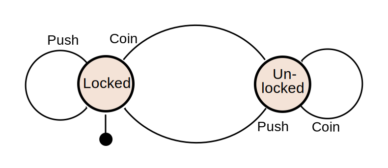

# Finite State Machine library for Golang

1st [small piece of theory](https://en.wikipedia.org/wiki/Finite-state_machine)

## Usage on the example of our favorite turnstile



```golang
const (
    locked fsm.State = iota
    unlocked

    coin fsm.Input = iota
    push
)

turnstile := fsm.New(locked).
    On(coin, locked, unlocked, func() error {
        // return errors.New("invalid coin")
        return nil
    }).
    On(coin, unlocked, unlocked).
    On(push, locked, locked).
    On(push, unlocked, locked, func() error {
        human++
        return nil
    })

err := turnstile.Do(coin)
turnstile.Do(push)

fmt.Println(human, turnstile.State)
```

More detailed [example](example/main.go). And look tests of course!

### Another known FSM implementations

* [github.com/rynorris/fsm](https://github.com/rynorris/fsm)
* [github.com/ryanfaerman/fsm](https://github.com/ryanfaerman/fsm)
* [github.com/looplab/fsm](https://github.com/looplab/fsm)